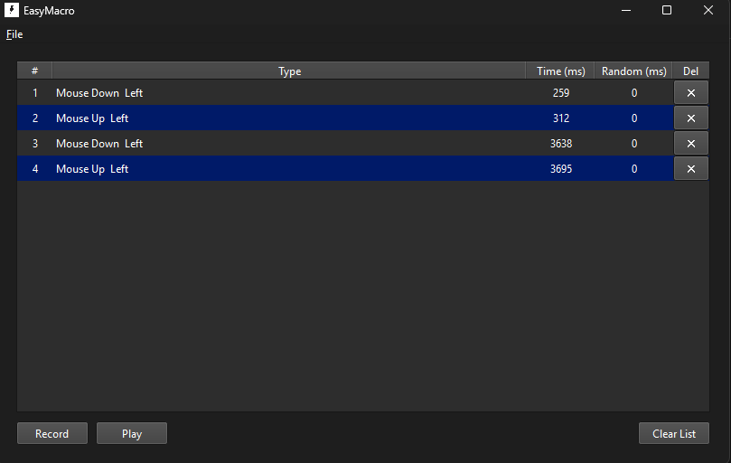

# EasyMacro

Lightweight Windows macro recorder and player built with C++17 and Qt 6.

Record mouse clicks, wheel input, and keyboard presses. Review every action, adjust its timing, then save or replay the macro with global hotkeys.



## Features

- Record mouse buttons, mouse wheel input, and keyboard presses
- Replay actions at recorded speed or instantly
- Edit action timing directly from the event list
- Add optional random delay to individual actions
- Configure global Run, Stop, and Record hotkeys
- Repeat a macro a fixed number of times or indefinitely
- Save and load portable `.emacro` and JSON files
- Works across virtual desktops and multi-monitor setups

## Quick start

1. Launch EasyMacro.
2. Press **Record** or the configured Record hotkey.
3. Perform the actions you want to automate.
4. Stop recording.
5. Review the event list and edit values if needed.
6. Press **Play** or the configured Run hotkey.

## Event editor

Each row represents one captured input event.

| Column | Meaning |
| --- | --- |
| `#` | Event order |
| `Type` | Captured mouse or keyboard action |
| `Time (ms)` | Event time measured from recording start |
| `Random (ms)` | Maximum optional extra delay before next action |
| `Del` | Removes event from macro |

Changing `Time (ms)` shifts following events by same amount, preserving their relative spacing.

## Settings

Open **File -> Settings** to configure:

- Run, Stop, and Record hotkeys
- Playback speed: recorded or instant
- Repeat count
- Infinite repeat mode

Default hotkeys:

| Action | Hotkey |
| --- | --- |
| Run macro | `F1` |
| Stop macro | `F2` |
| Record macro | `F3` |

## Macro files

Macros are stored as human-readable JSON. EasyMacro uses `.emacro` by default, while regular `.json` files are supported too.

## Build

### Requirements

- Windows
- CMake 3.16+
- C++17-compatible compiler
- Qt 6 Core and Widgets

### CMake

```powershell
cmake -S . -B build -DCMAKE_PREFIX_PATH="C:/Qt/6.10.0/msvc2022_64/lib/cmake"
cmake --build build --config Release
```

Executable is created in `build/Release` for multi-config generators, or directly in `build` for single-config generators.

## License

Released under the [MIT License](LICENSE).
